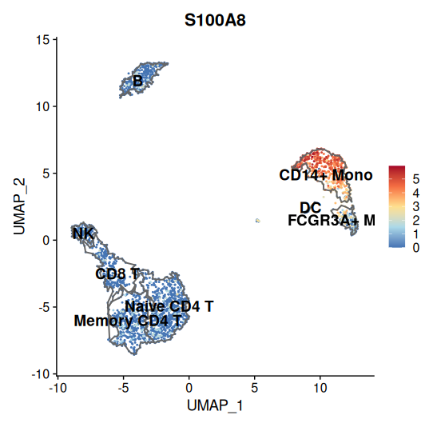
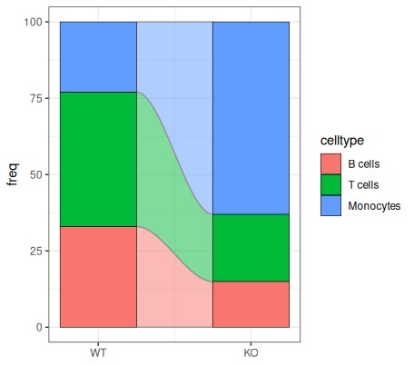

# Collection of data analysis functions

This package gathers a personal collection of helper functions for data analysis, QC, and plotting, etc...

``` r
# install with
install.packages("devtools")

devtools::install_github("vroh/utilityFunction")
# or
devtools::install_gitlab("vroh/utilityFunction")
```

## plot_feature_with_cluster_boundaries

This functions is useful for cluster annotation of Seurat objects. It is similar to `Seurat::FeaturePlot()` but additionaly displays cluster border limits on the UMAP.

``` r
plot_feature_with_cluster_boundaries(seurat_obj = pbmc3k.final, feature = "S100A8", group.by = "seurat_annotations", eps = 40)
```



## stacked_ribbon_plot

This functions plots stacked bars joined by ribbons to highlight proportion changes between groups

``` r
stacked_ribbon_plot(df, "group", "freq", "celltype", reverse_y = F)
```


